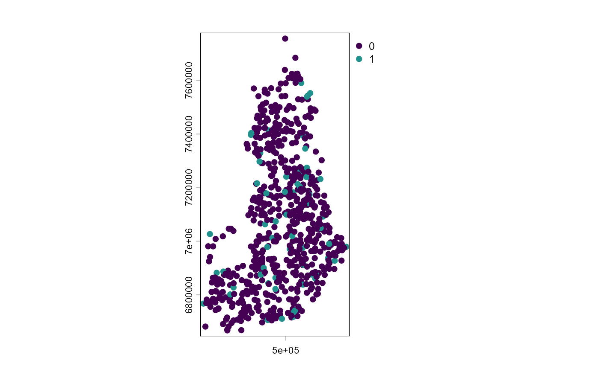
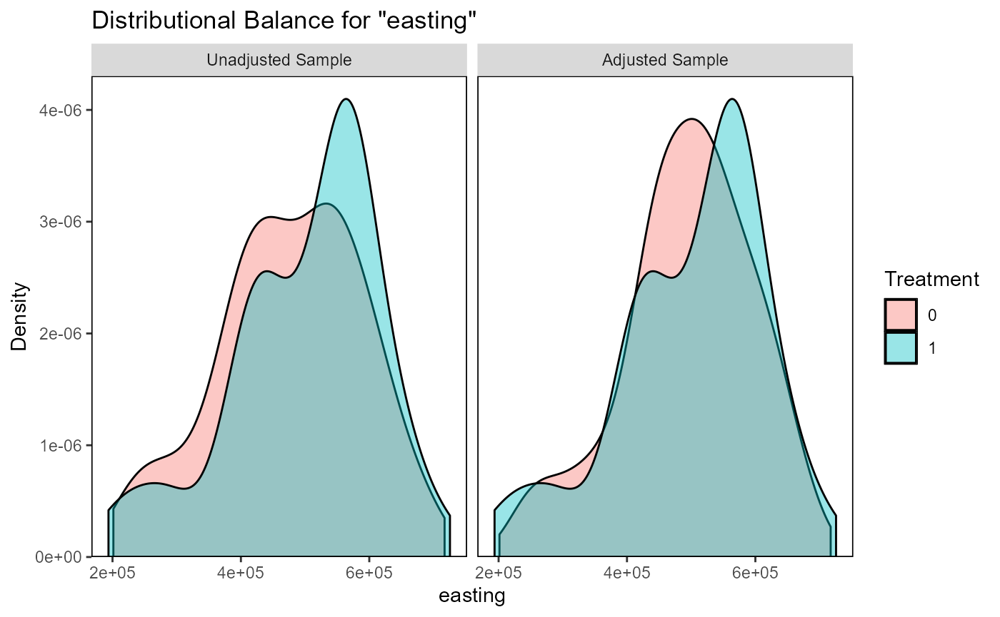
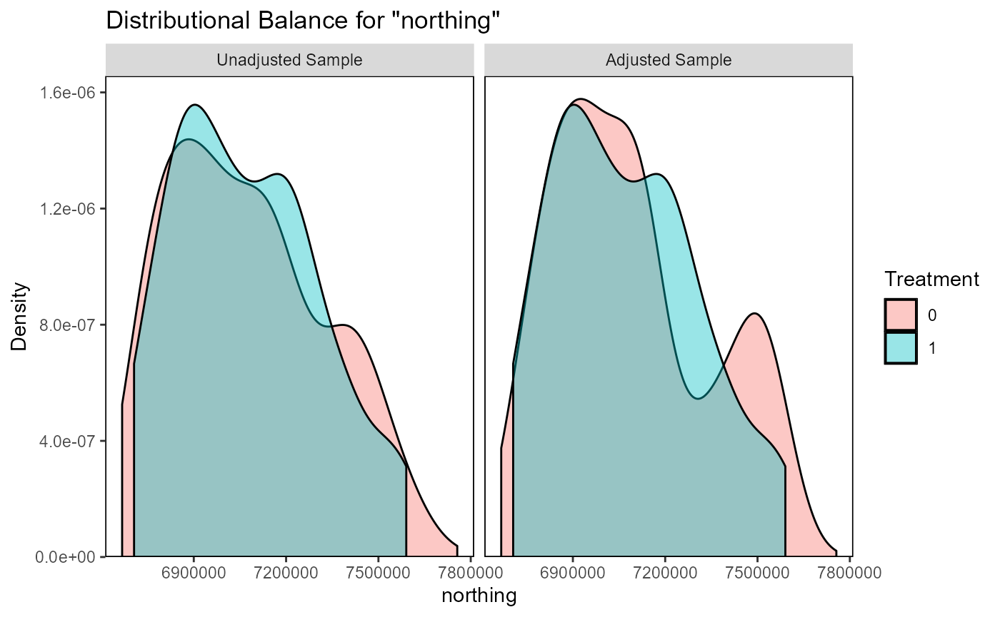
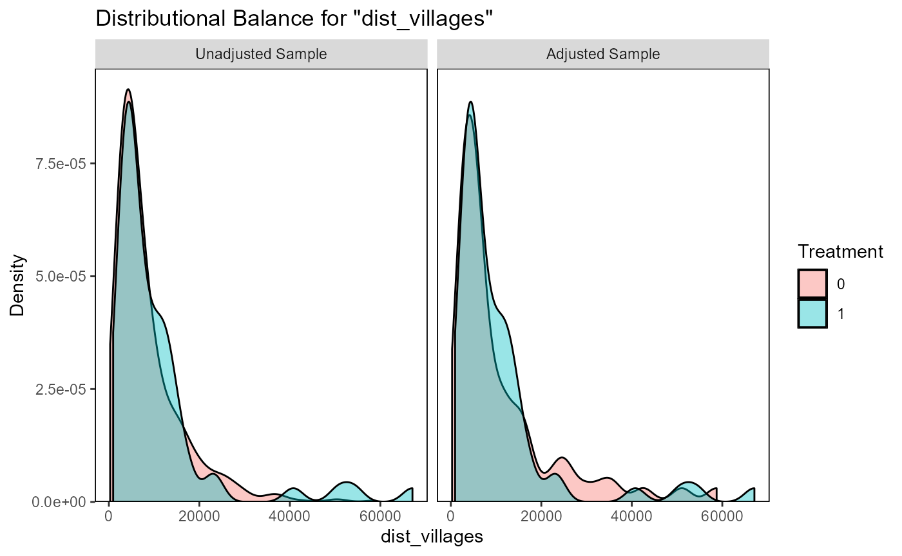
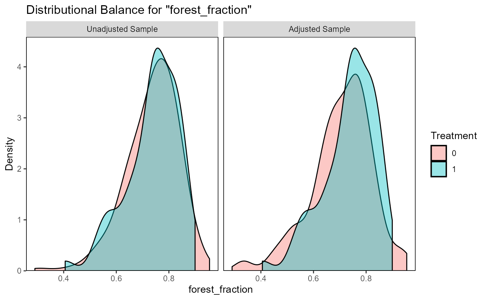
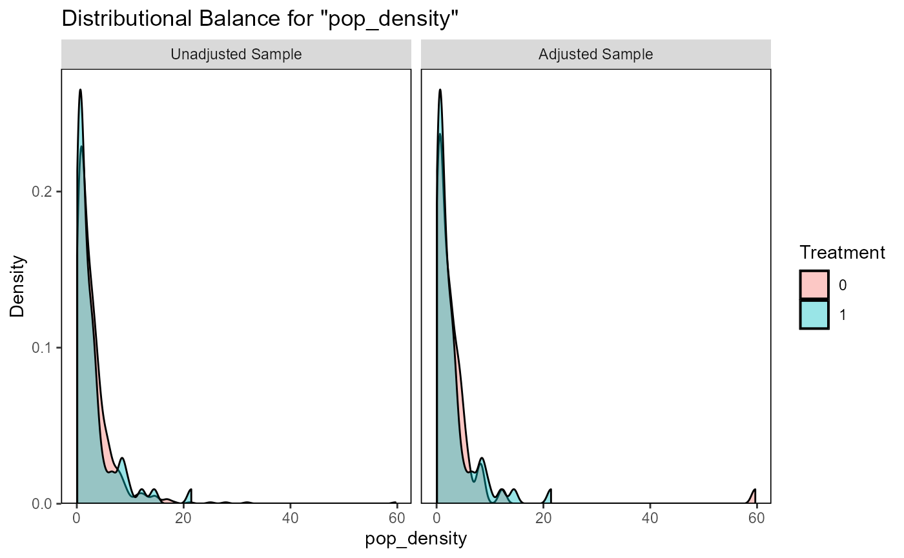
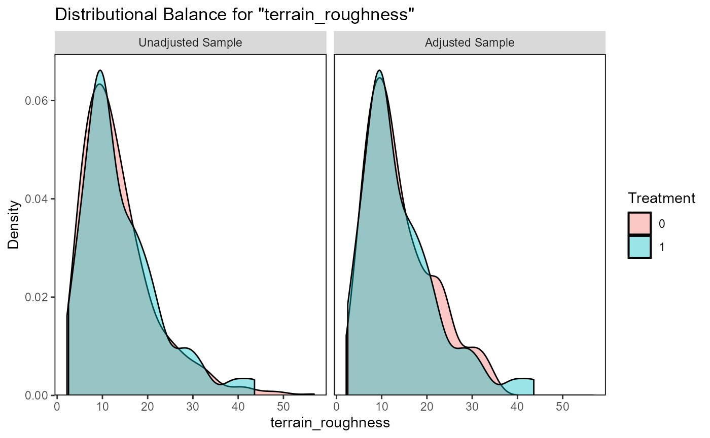
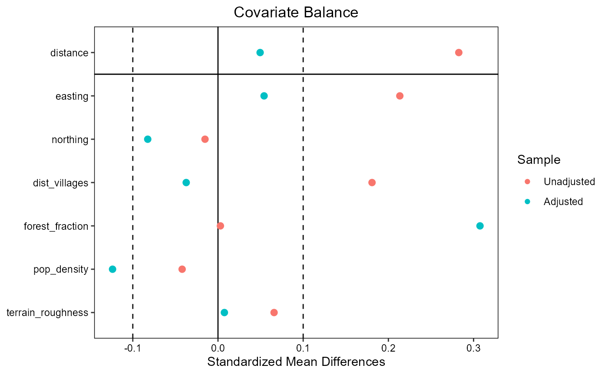

# wildlife_circles_Finland

``` r
library(spatialBACI)
library(terra)
```

## Wildlife circles dataset

To illustrate how the `spatialBACI` package can be used with pre-defined
monitoring sites, we use the `wildlife_circles` dataset, which is a
simplified subset of the data used by [Terraube et al.,
2020](https://www.nature.com/articles/s41467-020-16792-7). The dataset
is a simplification of the Finnish wildlife triangles monitoring scheme
([Helle et al.,
2016](https://cdnsciencepub.com/doi/10.1139/cjfr-2015-0454)), where each
circle is designed to pass through the three vertices of the triangle
made up of transects of 4 km. The `wildlife_circles` dataset provides
the outline of the circles as polygons with a generic “ID” assigned, and
indicates for each circles whether it is located in a protected area
(according to the [World Database on Protected
Areas](https://www.protectedplanet.net/en/thematic-areas/wdpa?tab=WDPA))
or not (value of 1/0 in attribute “PA”).

``` r
data(wildlife_circles)
wildlife_circles <- unwrap(wildlife_circles)

wildlife_circles
#>  class       : SpatVector 
#>  geometry    : polygons 
#>  dimensions  : 671, 2  (geometries, attributes)
#>  extent      : 191977.9, 727420.1, 6665446, 7757954  (xmin, xmax, ymin, ymax)
#>  coord. ref. : ETRS89 / TM35FIN(E,N) (EPSG:3067) 
#>  names       :    ID    PA
#>  type        : <int> <int>
#>  values      :     1     0
#>                    2     0
#>                    3     0
plot(centroids(wildlife_circles), "PA", )
```



In [Terraube et al.,
2020](https://www.nature.com/articles/s41467-020-16792-7), the authors
want to match wildlife circles inside protected areas to control sited
outside protected areas using six matching covariates:

- Latitude
- Longitude
- Distance to the closest settlement
- Terrain ruggedness
- Human population density
- Percentage forest cover

We will here show how to perform such analysis using the `spatialBACI`
package and other common R packages.

## Matching covariates

Extracting **longitude** and **latitude** of the centroids of polygons
in a SpatVector object, as is the case here, is rather straightforward
using the
[`terra::as.data.frame()`](https://rspatial.github.io/terra/reference/as.data.frame.html)
functions of the `terra` package, on which the `spatialBACI` package
builds. The following returns a data frame with for each wildlife circle
the original “ID” and “PA” columns, and additionally columns “x” and “y”
indicating the longitude and latitude of the centroid of the wildlife
circle.

``` r
LonLat <- centroids(wildlife_circles) |> as.data.frame(geom="XY")
```

**Distance to the closest settlement** can be obtained using
`osm_distance_places` function, where we define settlements
OpenStreetMap features of the category “village” or above. We set the
timeout argument to 100 (seconds) to allow retrieval of all settlements
in Finland.

``` r
dist_village <- osm_distance_places(x=wildlife_circles, values="village+", timeout=100, osm_bbox = "Finland")
```

**Terrain ruggedness** was by Terraube et al. defined as the standard
deviation of the elevation within the wildlife triangles, and was
included because large carnivores were expected to reach higher
densities in more rugged terrain. Because Finland is mostly to the north
of the area covered by the SRTM DEM, we will derive the terrain
ruggedness from the ALOS DEM freely available in the Planetary Computer
STAC catalog. We specify that we want to use the original 30m resolution
in x and y of the ALOS DEM.

``` r
dem_finland <- dem(x=wildlife_circles,
                 v="elevation",
                 dem_source=list(endpoint="https://planetarycomputer.microsoft.com/api/stac/v1",
                                 collection="alos-dem",
                                 assets="data"),
                 dx=30, dy=30)
```

There is no specific function in the `spatialBACI` package to extract
**human population density**. However, data in raster format stored
locally or accessible online can also easily be integrated. In this
example, we access the [WorldPop](https://hub.worldpop.org/) population
density of Finland for the year 2016 (the year used in Terraube et al.,
2020) at 1km resolution, found at
<https://hub.worldpop.org/geodata/summary?id=41175>.

``` r
popdens_url <- "https://data.worldpop.org/GIS/Population_Density/Global_2000_2020_1km/2016/FIN/fin_pd_2016_1km.tif"
```

**Percentage forest cover** was calculated by Terraube et al. (2020)
from the CORINE Land Cover (CLC) dataset for the year 2012. We
downloaded the CLC dataset for the year 2012 from the [Finnish
Environment Institute (SYKE)
website](https://www.syke.fi/en/environmental-data/downloadable-spatial-datasets#corine-land-cover)
(CORINE Land Cover 2012, 20 m geotiff (zip) (latest update 30.9.2014))
and downloaded and unzipped it to a local directory `D:/Data`.
Extracting the forest fraction over each wildlife circle requires
knowledge of the values under which the forest classes are stored (in
this case values 22 through 29), and a custom function
`forestFrac_function`.

``` r

clc_filename <- file.path("D:/Data/spatialBACI","clc2012_fi20m.tif")
forestFrac_function <- function(x){sum(x %in% 22:29)/length(x)}
```

The
[`collate_matching_layers()`](https://space4restoration.github.io/spatialBACI/reference/collate_matching_layers.md)
function is then designed to convert all these matching covariates in
different formats (data.frame, SpatVector, online or locally stored
rasters). For this, we have to provide as inputs to
[`collate_matching_layers()`](https://space4restoration.github.io/spatialBACI/reference/collate_matching_layers.md)
the SpatVector file with the candidate control and impact sites
(`wildlife_circles`), and a list of the matching variables. For matching
variables in raster format, additional information must be provided on
how the raster data will be summarized over the vector units of
analysis. In this case, the raster dataset must be provided as a named
list element “data”, and additional named list elements specify the
summarizing function. For population density, we want to calculate the
interpolated value of the four 1km pixels adjacent to the centroids of
the wildlife circles, which can be used by adding the list element
`method="bilinear"`. Surface roughness can be derived from the DEM by
setting the list element `fun=sd` (and `na.rm=TRUE` to ignore occasional
missing values in the DEM). Finally, for formula to derive forest
fraction is linked to the CLC raster dataset. This step may take a few
minutes, as the DEM data will in this step be downloaded and processed.

``` r
vars_list <- list(LonLat, 
                  dist_village, 
                  list(data=clc_filename,
                       fun=forestFrac_function),
                  list(data=popdens_url,
                       method="bilinear"),
                  list(data=dem_finland,
                       fun=sd, 
                       na.rm=TRUE)
                  )

matching_input_vector <- collate_matching_layers(wildlife_circles, vars_list=vars_list)
```

In the resulting object, the column names of the data.table referring to
the raster objects are simply taken from the layer names of the
corresponding file. For clarity, we can update the column names (though
they should not contain spaces).

``` r
matching_input_vector
#> $data
#>         ID    PA      x       y dist_places  OBJECTID fin_pd_2016_1km elevation
#>      <int> <int>  <num>   <num>       <num>     <num>           <num>     <num>
#>   1:     1     0 525952 7074646    6700.571 0.7325014       0.9526159 10.595218
#>   2:     2     0 292691 6789509    2832.911 0.7143827       2.2052165  9.535269
#>   3:     3     0 224286 6810768    3649.480 0.7311088       3.0462480  8.666103
#>   4:     4     1 243257 6882305    4978.423 0.4057153       0.8412691  5.335253
#>   5:     5     0 259491 6851807    1804.612 0.7654075       2.7937382  5.258316
#>  ---                                                                           
#> 667:   667     1 579276 7539446   50800.176 0.8995540       0.1023321  9.173672
#> 668:   668     0 550461 6838690    5149.095 0.7110290       2.1137298 13.109967
#> 669:   669     0 406736 7342837   12476.489 0.8474569       0.7097588  8.576482
#> 670:   670     0 539159 7623874    7862.777 0.9268883       0.3741452 33.181941
#> 671:   671     0 287663 6681534    1653.141 0.6267782      12.1432007 12.311376
#> 
#> $spat.ref
#>  class       : SpatVector 
#>  geometry    : polygons 
#>  dimensions  : 671, 2  (geometries, attributes)
#>  extent      : 191977.9, 727420.1, 6665446, 7757954  (xmin, xmax, ymin, ymax)
#>  coord. ref. : ETRS89 / TM35FIN(E,N) (EPSG:3067) 
#>  names       :    ID    PA
#>  type        : <int> <int>
#>  values      :     1     0
#>                    2     0
#>                    3     0
names(matching_input_vector$data)[3:8] <- c("easting", "northing", "dist_villages", "forest_fraction" ,"pop_density", "terrain_roughness")
```

## Control-impact matching

To match one wildlife circle outside protected area to each site within
a protected area without replacement using the collated matching
covariates, we simply provide this resulting object to the
[`matchCI()`](https://space4restoration.github.io/spatialBACI/reference/matchCI.md)
function. We must provide the column names defining the unique ID of
each spatial unit of analysis (`colname.id="ID"`) and the treatment
(`colname.treatment="PA"`). In this example, we use 1:1 matching without
replacement.

``` r
matching_output_vector <- matchCI(matching_input_vector,
                                  colname.id="ID", colname.treatment="PA",
                                  ratio=1, replace=FALSE, method="nearest")
```

Matching results can now be evaluated using
[`evaluate_matching()`](https://space4restoration.github.io/spatialBACI/reference/evaluate_matching.md),
after which the user can decide to continue their analysis with the
matched dataset or repeat matching with different parameters.

``` r
evaluate_matching(matching_output_vector)
#> Balance Measures
#>                       Type Diff.Adj
#> distance          Distance   0.0495
#> easting            Contin.   0.0541
#> northing           Contin.  -0.0825
#> dist_villages      Contin.  -0.0373
#> forest_fraction    Contin.   0.3075
#> pop_density        Contin.  -0.1238
#> terrain_roughness  Contin.   0.0075
#> 
#> Sample sizes
#>           Control Treated
#> All           610      61
#> Matched        61      61
#> Unmatched     549       0
#> Press <Enter> to continue.
```



    #> Press <Enter> to continue.



    #> Press <Enter> to continue.



    #> Press <Enter> to continue.



    #> Press <Enter> to continue.



    #> Press <Enter> to continue.



    #> Press <Enter> to continue.



    #> Press <Enter> to continue.
