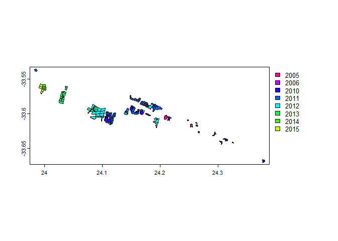
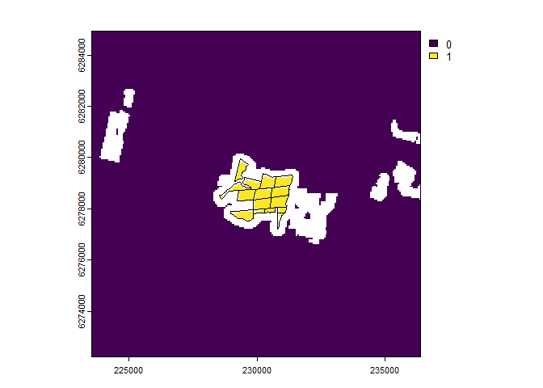
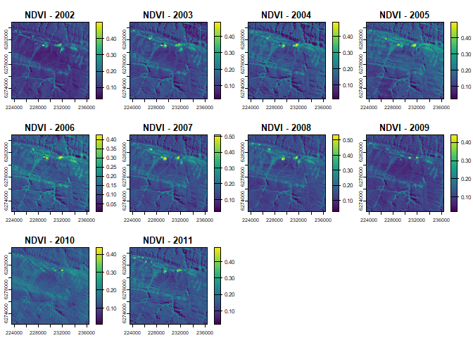
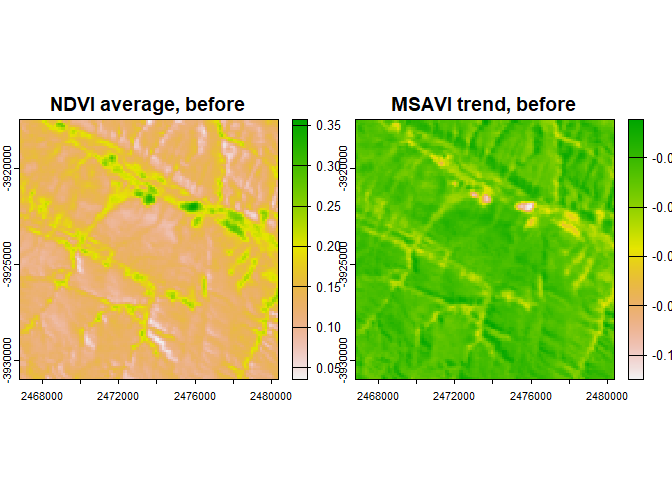
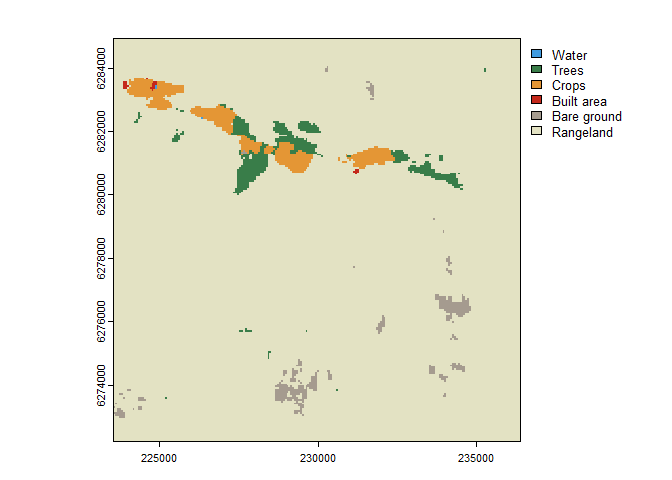
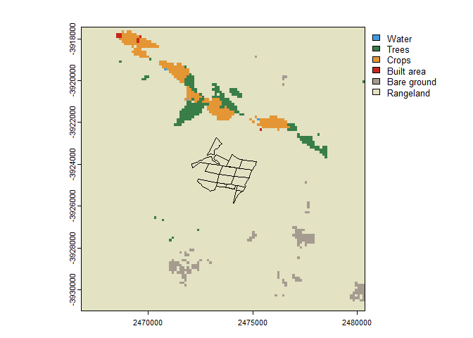
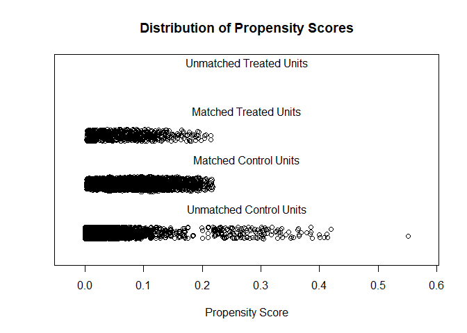
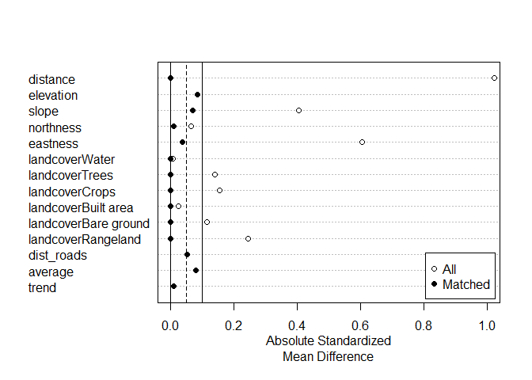
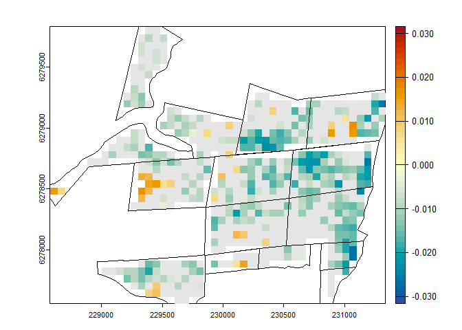

BACI evaluation Baviaanskloof
================
Jasper Van doninck, Trinidad del Río-Mena, Wieteke Willemen, Wietske
Bijker

- [1 The Baviaanskloof dataset](#1-the-baviaanskloof-dataset)
- [2 Spatial unit of analysis and candidate control
  units](#2-spatial-unit-of-analysis-and-candidate-control-units)
- [3 Evaluation metric](#3-evaluation-metric)
- [4 Control-Impact Matching](#4-control-impact-matching)
- [5 Before-After-Control-Impact
  evaluation](#5-before-after-control-impact-evaluation)

# 1 The Baviaanskloof dataset

We here use a part of the Baviaanskloof dataset used in [del Río-Mena et
al.,
2021](https://journals.plos.org/plosone/article?id=10.1371/journal.pone.0243020),
included in the `EnvImpactEval` package, to demonstrate a
before-after-control-impact (BACI) evaluation using the package. The
Baviaanskloof dataset contains the sites of large-scale spekboom
(*Portulacaria afra*) revegetation in the semi-arid Baviaanskloof
Hartland Bawarea Conservancy, South-Africa. Attributes to the spatial
data indicate in which year the revegetation was undertaken by the
different restoration organizations active in the area (Commonland,
Living Land, Grounded) and whether lifestock grazing exclusion was
implemented as a restoration activity or not. As an example, we here
select the sites revegetated in 2012 that were not subject to lifestock
grazing exclusion.

``` r
library(EnvImpactEval)
data(baviaanskloof)
baviaanskloof <- unwrap(baviaanskloof)

year <- 2012
impact_sites <- baviaanskloof[baviaanskloof$Planting_date==year & baviaanskloof$Lifestock_exclusion==0]
other_sites <- baviaanskloof[baviaanskloof$Planting_date!=year | baviaanskloof$Lifestock_exclusion==1]

plot(baviaanskloof, "Planting_date")
lines(impact_sites, lwd=2)
```

<!-- -->

# 2 Spatial unit of analysis and candidate control units

The `EnvImpactEval` package requires the user to define the spatial unit
at which the analysis will be performed. The options for this are the
pixel unit (using raster-based analysis) or the polygon/point unit
(using vector-based analysis). The latter can be useful when working
with extensive networks of fixed monitoring sites from which the control
sites can be expected. One of the advantages of the pixel unit is that
it is not required that candidate control sites are predefined. Another
advantage is that, depending on the size of impact sites and spatial
resolution of the used remotely sensed datasets, information on impact
within an impact site can be assessed. For this example we will use
pixels as the spatial unit of analysis and reporting.

When using a raster-based analysis, the first choice the user will have
to make is the spatial resolution of the pixel units. We here choose a
spatial resolution of 60m, since this is a resolution to which several
Earth Observation datasets (e.g., Landsat, Sentinel-2) can be
aggregated. The next step is to identify the area from which the control
pixels for the Before-After-Control-Impact an be selected. The
`EnvImpactEval` package provides several options for this. The first
option is by providing a spatial window around the impact units, the
second is providing a polygon identifying the area from which to select
the control pixels. The package also provides options to exclude areas
from use as control in the BACI analysis. This exclusion can be based on
user-provided polygons, or buffer area around the impact sites (e.g., to
eliminate the effect of misregistration of impact sites or of positive
or negative adjacency effects). All these options to include or exclude
candidate control units can be combined based on the user’s terrain
knowledge and data availability in the `create_control_candidates`
function. In this example, we set a window of 5 km around the sites
reforested in 2012 (with the `control_from_buffer` argument) and exclude
areas restored in the other years as control pixels (with the
`control_exclude` argument). Finally, we use the argument
`exclude_impact_buffer` to exclude pixels in a buffer of 240 m around
the impact sites for selection as control units. The
`create_control_candidates` function also allows us the specify the
Coordinate Reference System (trough the `crs` argument) of the reference
raster at which the analysis will be done. This can be useful if, e.g.,
the user wants to use a national reference system. In our example we
don’t provide the crs parameter, in which case the UTM zone of centroid
of the impact sites will be used.

``` r
matchingCands <- create_control_candidates(impact_sites,
                                           resolution=60,
                                           control_from_buffer=5000,
                                           control_from_include=NULL,
                                           control_exclude=other_sites,
                                           exclude_impact_buffer=+240,
                                           round_coords=2)

plot(matchingCands)
lines(project(impact_sites, matchingCands))
```

<!-- -->

The resulting plot shows the impact units/pixels (1), the candidate
control units/pixels (0), and the pixels excluded from analysis in
white. Notice that the plot shows UTM coordinates, rather than the
geographic coordinates of the Baviaanskloof reference dataset. In
general, the `EnvImpactEval` package will automatically check the crs of
used spatial datasets and reproject when required.

# 3 Evaluation metric

We here chose Landsat Normalized Difference Vegetation Index (NDVI) as
the metric to use in the impact evaluation. NDVI is indicative of
vegetation “greenness” and could therefore inform us whether a large
scale revegetation effort was successful. The Landsat programme has been
running for several decades and is therefore a useful data source for
impact evaluation of past interventions. Landsat data are available from
several cloud platforms. We here use Microsoft’s Planetary Computer,
which allows querying with the SpatioTemporal Asset Catalog (STAC)
language.

``` r
stac_endpoint <- as.endpoint("PlanetaryComputer")
stac_collection <- as.collection("Landsat", stac_endpoint)
```

The timeframes over which conservation or restoration impacts are
assessed will depend on the application and study site. Assuming we want
to evaluate the impact of the Baviaanskloof revegetation from the 5-year
periods before and the 10-year after the intervention year, we can first
generate yearly NDVI time series for all impact and candidate control
pixels:

``` r
vi_before <- eo_VI_yearly.stac(matchingCands, "NDVI",
                               endpoint=stac_endpoint, collection=stac_collection,
                               years=seq(year-5, year-1, 1),
                               months = 3:5,
                               maxCloud=60)
vi_after <- eo_VI_yearly.stac(matchingCands, "NDVI",
                              endpoint=stac_endpoint, collection=stac_collection,
                              years=seq(year+1, year+10, 1),
                              months = 3:5,
                              maxCloud=60)
```

In the above code, we specified that we want to make a pixel-based NDVI
composite image for each year, using for each pixel and each year the
median value from the images acquired in the months March until May that
have a cloud cover below 60%. The function `eo_VI_yearly.stac` above
generates proxy data cubes, which don’t contain any data but describe
the dimension of the object. Data retrieval and calculations are only
performed when the data values contained in these objects are needed.
Working with data cubes has the advantage that unnecessary calculations
are avoided for bands, time steps and/or coordinates that are not used
in later steps. This can be extremely useful when dealing with large
areas from which only limited data has to be extracted, e.g., sparse
monitoring location distributed over a continental-scale area. In such a
case you do not want to process data wall-to-wall over the continental
scale, but only over these sparse locations. In our Baviaanskloof
example, however, we only cover a geographically small area with a
relatively dense cover of impact and candidate control units. In such
case it can be useful to transform the data cubes to `SpatRaster`
objects (from `terra` package). Doing this downloads and process all
data and reads the resulting composite images into memory (or writes
them to temporal files).

``` r
vi_before <- as.SpatRaster(vi_before)
vi_after <- as.SpatRaster(vi_after)
plot(vi_before, main=paste0("NDVI - ",seq(year-5, year-1, 1)))
```

<!-- -->

``` r
plot(vi_after, main=paste0("NDVI - ",seq(year+1, year+10, 1)))
```

<!-- -->

To transform these time series into simple metrics that can be used in a
BACI analysis, we here calculate average value and trend (change in
NDVI/year) over the time series before and after intervention. This
basic time series analysis is included in the `EnvImpactEval` package,
but user can easily implement their own analyses, as long as these
return raster layers of the evaluation variable of interest before and
after intervention.

``` r
avgtrend_before <- calc_ts_metrics(vi_before)
avgtrend_after <- calc_ts_metrics(vi_after)
```

# 4 Control-Impact Matching

In impact assessment using control-impact (of
before-after-control-impact) schemes, it is crucial that the control
units are carefully selected so that their characteristics only differ
from those of the impact group by the received “treatment” (in our case
a restoration intervention). This is in the `EnvImpactEval` package done
by specifying a set of covariates to be used in the matching analysis.
Ideally, users should include “all covariates likely to impact both the
selection to the treatment and the outcome of interest” ([Schleicher et
al.](https://onlinelibrary.wiley.com/doi/abs/10.1111/cobi.13448)).

For the Baviaanskloof example, we use a limited number of matching
covariates. Because we restricted the search window for control units to
a relatively small area around the impact sites, we assume that climatic
variation will be small and mostly induced by local topography.
Topographic slope and aspect may also determine whether or not a site is
selected for revegetation or determine the success of the revegetation
intervention. This terrain data can be extracted from the NASA Digital
Elevation Model (DEM) based on SRTM data using the `dem` function.
Unless specified otherwise, the DEM will be obtained from Microsoft’s
Planetary Computer. The user can also specify the terrain derivatives to
be calculated (by default the slope and the aspect), and whether the
aspect should be transformed to “northness” and “eastness” by applying
the cosine and sine function on it (default) or not.

``` r
dem_matching <- dem(matchingCands)
plot(dem_matching)
```

<!-- -->

We also included land cover as a matching covariate. This will ensure
that control pixel are selected from the same landcover type
(i.e. “rangeland”). Note that in the current implementation the 9-class
land use land cover layer from Impact Observatory is used. This product
is first generated for the year 2017, so we assume no change in land
cover change between the intervention year (2012) and 2017. Given that
terrain revegetated with spekboom will still be classified as
“rangeland” this is not an issue in this example, but it may be a
problem for other situations.

``` r
landcover_matching <- lulc(matchingCands, year=year)
```

    ## Warning in .local(x, year, endpoint, collection, assets, authOpt, ...): Land
    ## cover product io-lulc-9-class currently has data 2017-2022. 2017 selected.

``` r
plot(landcover_matching)
```

<!-- -->

Distance to roads or settlements can explain the anthropogenic pressure
on an area. The `EnvImpactEval` package therefore includes functions to
calculate the distance to the nearest road (`osm_distance_roads`) or
nearest settlement (`osm_distance_places`) based on OpenStreetMap data.
For this example, we include the distance to the nearest road of OSM
category “track” or higher as an environmental covariate in the matching
analysis.

``` r
roadsDist_matching <- osm_distance_roads(matchingCands, values="track+")
plot(roadsDist_matching)
```

<!-- -->

We then perform the control-impact matching with the `matchCI` function
using propensity score matching (default method), and select 10 control
pixels for each impact pixel (argument `ratio`) with replacement
(argument `replace`), meaning that a control pixel can be paired with
several impact pixels. This step can be performed interactively by
setting the parameter `eval=TRUE`, which will display matching results
and plots after which the matching can be accepted or rejected. As
matching layer, we select the layers described above (DEM, land cover
and distance to tracks), together with the average and trend of the
selected vegetation index in the 5-year period before the restoration
intervention. This way, control pixels will be selected that have
undergone a similar temporal trajectory as the impact pixels in the
years before intervention. All selected matching layers provided to the
`matchVars` argument can be easily combined using a `list()` command.

``` r
CI_matches <- matchCI(cands=matchingCands, 
                      matchVars=list(dem_matching, 
                                     landcover_matching,
                                     roadsDist_matching,
                                     avgtrend_before), 
                      ratio=10, replace=TRUE, eval=TRUE)
```

    ## A `matchit` object
    ##  - method: 10:1 nearest neighbor matching with replacement
    ##  - distance: Propensity score
    ##              - estimated with logistic regression
    ##  - number of obs.: 41533 (original), 5226 (matched)
    ##  - target estimand: ATT
    ##  - covariates: elevation, slope, northness, eastness, landcover, dist_roads, average, trend
    ## Press <Enter> to continue.
    ## 
    ## Call:
    ## MatchIt::matchit(formula = frm, data = dt, method = method, distance = distance, 
    ##     link = link, replace = replace, ratio = ratio)
    ## 
    ## Summary of Balance for All Data:
    ##                      Means Treated Means Control Std. Mean Diff. Var. Ratio
    ## distance                    0.0561        0.0149          1.0211     2.0603
    ## elevation                 546.2999      703.4295         -2.3675     0.1285
    ## slope                       0.2301        0.2721         -0.4061     0.3091
    ## northness                   0.0969        0.0510          0.0644     0.9952
    ## eastness                    0.4167        0.0799          0.6056     0.6449
    ## landcoverWater              0.0000        0.0001         -0.0086          .
    ## landcoverTrees              0.0000        0.0193         -0.1413          .
    ## landcoverCrops              0.0000        0.0232         -0.1552          .
    ## landcoverBuilt area         0.0000        0.0007         -0.0259          .
    ## landcoverBare ground        0.0000        0.0127         -0.1145          .
    ## landcoverRangeland          1.0000        0.9441          0.2453          .
    ## dist_roads                529.3399      880.9122         -1.0889     0.1317
    ## average                     0.1261        0.1387         -0.9725     0.1308
    ## trend                      -0.0000       -0.0000         -0.3697     0.3158
    ##                      eCDF Mean eCDF Max
    ## distance                0.3687   0.5680
    ## elevation               0.2543   0.5803
    ## slope                   0.0927   0.1958
    ## northness               0.0246   0.0619
    ## eastness                0.1393   0.2423
    ## landcoverWater          0.0001   0.0001
    ## landcoverTrees          0.0193   0.0193
    ## landcoverCrops          0.0232   0.0232
    ## landcoverBuilt area     0.0007   0.0007
    ## landcoverBare ground    0.0127   0.0127
    ## landcoverRangeland      0.0559   0.0559
    ## dist_roads              0.0901   0.2457
    ## average                 0.1296   0.2582
    ## trend                   0.1410   0.2609
    ## 
    ## Summary of Balance for Matched Data:
    ##                      Means Treated Means Control Std. Mean Diff. Var. Ratio
    ## distance                    0.0561        0.0561         -0.0000     1.0011
    ## elevation                 546.2999      535.5230          0.1624     0.2728
    ## slope                       0.2301        0.2359         -0.0559     0.2184
    ## northness                   0.0969        0.1058         -0.0125     1.0266
    ## eastness                    0.4167        0.4115          0.0095     0.9546
    ## landcoverWater              0.0000        0.0000          0.0000          .
    ## landcoverTrees              0.0000        0.0000          0.0000          .
    ## landcoverCrops              0.0000        0.0000          0.0000          .
    ## landcoverBuilt area         0.0000        0.0000          0.0000          .
    ## landcoverBare ground        0.0000        0.0000          0.0000          .
    ## landcoverRangeland          1.0000        1.0000          0.0000          .
    ## dist_roads                529.3399      501.3413          0.0867     0.2993
    ## average                     0.1261        0.1293         -0.2513     0.1527
    ## trend                      -0.0000       -0.0000          0.1087     0.5013
    ##                      eCDF Mean eCDF Max Std. Pair Dist.
    ## distance                0.0001   0.0040          0.0020
    ## elevation               0.0911   0.2550          1.3318
    ## slope                   0.1552   0.2975          1.8682
    ## northness               0.0174   0.0401          1.1650
    ## eastness                0.0104   0.0321          0.9679
    ## landcoverWater          0.0000   0.0000          0.0000
    ## landcoverTrees          0.0000   0.0000          0.0000
    ## landcoverCrops          0.0000   0.0000          0.0000
    ## landcoverBuilt area     0.0000   0.0000          0.0000
    ## landcoverBare ground    0.0000   0.0000          0.0000
    ## landcoverRangeland      0.0000   0.0000          0.0000
    ## dist_roads              0.1022   0.2252          1.3774
    ## average                 0.1164   0.2287          2.0783
    ## trend                   0.0260   0.0598          1.2324
    ## 
    ## Sample Sizes:
    ##                Control Treated
    ## All           40889.       644
    ## Matched (ESS)  3412.34     644
    ## Matched        4582.       644
    ## Unmatched     36307.         0
    ## Discarded         0.         0
    ## 
    ## Press <Enter> to continue.

<!-- -->

    ## Press <Enter> to continue.

<!-- -->

    ## Accept matching (Y/N)?

From the output of the matching analysis, we can see that the Absolute
Standardized Mean Difference (ASMD) after matching is below the
threshold of 0.1 for the propensity score distance and most individual
matching variables, but above this threshold for a few individual
variables. Based on these outputs we can accept the matching (which we
will do here) or reject the matching and attempt matching with different
matching parameters. The user also has the option to set the `asmd_warn`
and/or `asmd_error` parameters to return a warning or error message,
respectively if ASMD is above defined thresholds.

# 5 Before-After-Control-Impact evaluation

To run the BACI analysis, we need to provide the matched control-impact
pairs (argument `CI_matches`) and the raster datasets of the `before`
and `after` period to the `BACI_contrast` function. We can also specify
a spatial reference raster to which the pixel-based results will be
written in the `rast.out` argument. The BACI analysis will be performed
for all layers in the `before` and `after` layers, which in our example
are both the average and trend over the time series.

``` r
baci_results <- BACI_contrast(CI_matches, before=avgtrend_before, after=avgtrend_after, rast.out=avgtrend_before)
```

The results of the BACI analysis can be viewed by printing the
data.table associated to the output object. The data.table shows, for
each impact unit and each evaluation variable, the BACI contrast and
p-values. BACI contrast values smaller than zero indicate a positive
effect of the revegetation intervention.

``` r
baci_results$data
```

    ## Key: <subclass>
    ##      subclass        x       y contrast.average p_value.average contrast.trend
    ##        <fctr>    <num>   <num>            <num>           <num>          <num>
    ##   1:        1 229386.6 6279807    -0.0003746176     0.895031108   1.392449e-05
    ##   2:        2 229446.6 6279807    -0.0054747330     0.382346104   1.688120e-05
    ##   3:        3 229326.6 6279747     0.0078372022     0.201407228   8.659828e-06
    ##   4:        4 229386.6 6279747    -0.0027284429     0.446653584   1.699763e-05
    ##   5:        5 229446.6 6279747     0.0013735059     0.667809116   1.690212e-05
    ##  ---                                                                          
    ## 640:      640 229746.6 6277647     0.0046694804     0.288592095   1.407298e-05
    ## 641:      641 229806.6 6277647    -0.0096939892     0.092589067  -1.062089e-05
    ## 642:      642 230886.6 6277647    -0.0046333133     0.341301624   1.744167e-05
    ## 643:      643 229626.6 6277587     0.0077999164     0.059704736   1.796409e-05
    ## 644:      644 229686.6 6277587     0.0196893863     0.001993363   2.236806e-07
    ##      p_value.trend
    ##              <num>
    ##   1:  4.685798e-02
    ##   2:  4.948313e-04
    ##   3:  1.362737e-01
    ##   4:  5.336991e-06
    ##   5:  8.506292e-04
    ##  ---              
    ## 640:  9.864862e-03
    ## 641:  2.144863e-02
    ## 642:  7.827747e-04
    ## 643:  6.673863e-02
    ## 644:  9.391747e-01

The BACI results can also be plotted on a map, here with non-significant
BACI contrast masked out. If desired, the pixel-based results can now be
aggregated to different spatial levels, e.g., the revegetation site.

``` r
plot(baci_results$spat["contrast.average"] |> trim(), 
     range=baci_results$spat["contrast.average"] |> minmax() |> abs() |> max() |> rep(2)*c(-1,1), 
     col=hcl.colors(50, palette = "RdYlBu", rev = TRUE))
maskImg <- classify(baci_results$spat["p_value.average"], rcl=  matrix(ncol=3, data= c(0,0.05, NA, 0.05,1,1), byrow = TRUE))
plot(maskImg, 
     col=c('grey90'),
     add=TRUE, 
     legend=FALSE)
lines(project(impact_sites, baci_results$spat))
```

<!-- -->
