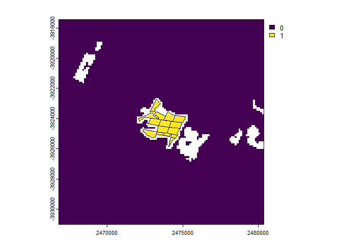
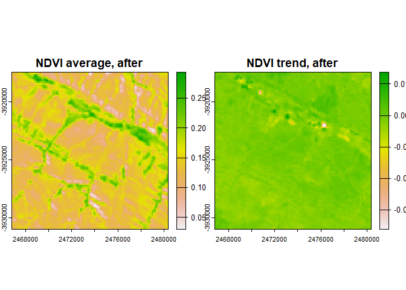
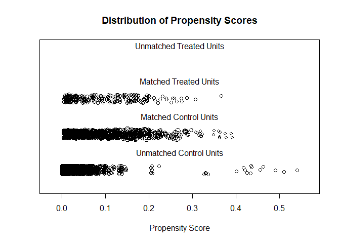
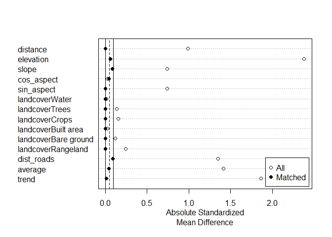
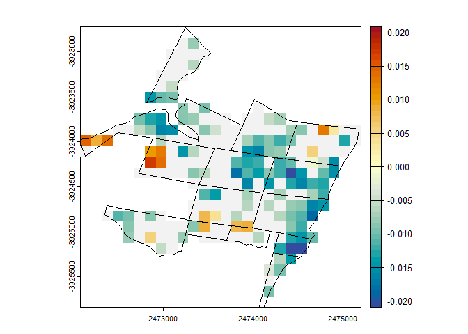

BACI evaluation Baviaanskloof
================
Jasper Van doninck, Trinidad del Río-Mena, Wieteke Willemen, Wietske
Bijker

- [1 The Baviaanskloof dataset](#1-the-baviaanskloof-dataset)
- [2 Spatial reference and the candidate control
  pixels](#2-spatial-reference-and-the-candidate-control-pixels)
- [3 Evaluation metric](#3-evaluation-metric)
- [4 Control-Impact Matching](#4-control-impact-matching)
- [5 Before-After-Control-Impact
  evaluation](#5-before-after-control-impact-evaluation)

# 1 The Baviaanskloof dataset

We here use a part of the Baviaanskloof dataset created by [del Río-Mena
et al.,
2021](https://journals.plos.org/plosone/article?id=10.1371/journal.pone.0243020),
included in the package, to demonstrate a before-after-control-impact
(BACI) evaluation using the package. The Baviaanskloof dataset contains
the sites of large-scale spekboom (*Portulacaria afra*) revegetation in
the semi-arid Baviaanskloof Hartland Bawarea Conservancy, South-Africa.
Attributes to the spatial data indicate in which year the revegetation
was undertaken by the different restoration organizations active in the
area (Commonland, Living Land, Grounded) and whether lifestock grazing
exclusion was implemented as a restoration activity or not. As an
example, we here select the sites revegetated in 2012 that were not
subject to lifestock grazing exclusion.

``` r
library(EnvImpactEval)
data(baviaanskloof)
baviaanskloof <- unwrap(baviaanskloof)

year <- 2012
selected_sites <- baviaanskloof[baviaanskloof$Planting_date==year & baviaanskloof$Lifestock_exclusion==0]
other_sites <- baviaanskloof[baviaanskloof$Planting_date!=year | baviaanskloof$Lifestock_exclusion==1]
plot(baviaanskloof, "Planting_date")
lines(selected_sites, lwd=2)
```

<!-- -->

# 2 Spatial reference and the candidate control pixels

The package requires the user to define the spatial parameters at which
the analysis will be performed. This reference will define the spatial
units of the analysis and the neighbourhood around the impact units in
which we want to search for control units. For now, only a raster
(pixel)-based framework is implemented, a vector-based framework is
planned for a future release.

Using the function, the user can easily define this spatial reference
raster based on the input data of the intervention to be evaluated (in
our example the Baviaanskloof revegetation polygons for the year 2012).
The spatial resolution of the reference raster will typically be linked
to the spatial resolution of the (earth observation) datasets used in
the analysis and we here set this to 120 meters. In order to limit data
download and processing time we restrict the search area for potential
control units to a bounding box with a buffer of 5 km around the sites
reforested in 2012, but the user can choose to set this neighbourhood in
function of their knowledge of their study sites. The user can also
specify the Coordinate Reference System (crs) of the reference raster.
In our example we don’t provide the crs parameter, in which case the UTM
zone of the Baviaanskloof reference dataset will be used.

``` r
refRas <- ref_rast(selected_sites, resolution=120, buffer=5000, round_coords=-2)
```

The function is then used to further specify the impact units (pixels)
and candidate control units that will be used in the BACI analysis. In
order to avoid undesired effects of spatial misregistration or adjacency
effects (the area just outside a restoration or conservation
intervention site may be subject to positive or negative effects from
the intervention), the user can exclude pixels in a buffer within or
around the impact sites. In the case of an outside buffer this is in our
example done with the argument . We obviously also exclude the areas
restored in the other years as control pixels with the argument.

``` r
matchingCands <- matchCandidates(selected_sites, refRas, excludeBufferOut=150, excludeOther = other_sites)
```

We can now plot a map showing the impact pixels (in green), the
potential control pixels (in grey), and the excluded pixels (in white).
Notice that the map shows UTM coordinates (as this was by default for
the argument in function), rather than the geographic coordinates of the
Baviaanskloof reference dataset. In general, the package will
automatically check the crs of used spatial datasets and reproject when
required.

``` r
plot(matchingCands)
selected_sites_proj <- project(selected_sites, refRas)
lines(selected_sites_proj)
```

<!-- -->

# 3 Evaluation metric

We here chose Landsat Normalized Difference Vegetation Index (NDVI) as
the metric to use in the impact evaluation. NDVI is indicative of
vegetation “greenness” and could therefore inform us whether a large
scale revegetation effort was successful. The Landsat programme has been
running for several decades and is therefore a useful data source for
impact evaluation of past interventions. Landsat data are available from
several cloud platforms. We here use Microsoft’s Planetary Computer,
which allows querying with the SpatioTemporal Asset Catalog (STAC)
language.

``` r
stac_endpoint <- as.endpoint("PlanetaryComputer")
stac_collection <- as.collection("Landsat", stac_endpoint)
```

The timeframes over which conservation or restoration impacts are
assessed will depend on the application and study site. Assuming we want
to evaluate the impact of the Baviaanskloof revegetation from the
10-years periods before and after the intervention year, we can first
generate yearly NDVI time series (these steps can take a few minutes
depending on the defined size and spatial resolution of the reference
raster):

``` r
vi_before <- VI_composite(endpoint=stac_endpoint, 
                         collection=stac_collection, 
                         VI="NDVI", 
                         spatRef = refRas, 
                         years = seq(year-10, year-1, 1), 
                         months = 3:5, 
                         maxCloud=60)

vi_after <- VI_composite(endpoint=stac_endpoint, 
                         collection=stac_collection, 
                         VI="NDVI", 
                         spatRef = refRas, 
                         years = seq(year+1, year+10, 1), 
                         months = 3:5, 
                         maxCloud=60)
```

In the above code, we specified that we want to make a pixel-based NDVI
composite image for each year, using for each pixel and each year the
median value from the images acquired in the months March until May that
have a cloud cover below 60%.

We then calculate simple time series metrics from these two 10-year time
series: the average value and trend (change in NDVI/year) over the time
series. More advanced time series analysis methods will be added in a
later version of the .

``` r
avgtrend_before <- calc_ts_metrics(vi_before)
avgtrend_after <- calc_ts_metrics(vi_after)

plot(avgtrend_before, main=c("NDVI average, before", "MSAVI trend, before"))
```

<!-- -->

``` r
plot(avgtrend_after, main=c("NDVI average, after", "MSAVI trend, after"))
```

<!-- -->

# 4 Control-Impact Matching

In impact assessment using control-impact (of
before-after-control-impact) schemes, it is crucial that the control
units are carefully selected so that their characteristics only differ
from those of the impact group by the received “treatment” (in our case
a restoration intervention). This is in the package done by specifying a
set of covariates to be used in the matching analysis. Ideally, users
should include “all covariates likely to impact both the selection to
the treatment and the outcome of interest” ([Schleicher et
al.](https://onlinelibrary.wiley.com/doi/abs/10.1111/cobi.13448)).

For the Baviaanskloof example, we use a limited number of matching
covariates. Because we restricted the search window for control units to
a relatively small area around the impact sites, we assume that climatic
variation will be small and mostly induced by local topography.
Topographic slope and aspect may also determine whether or not a site is
selected for revegetation or determine the success of the revegetation
intervention. This terrain data can be extracted from the NASA Digital
Elevation Model (DEM) based on SRTM data using the function. Unless
specified otherwise, the DEM will be obtained from Microsoft’s Planetary
Computer. The user can also specify the terrain derivatives to be
calculated (by default the slope and the aspect), and whether the aspect
should be transformed to “northness” and “eastness” by applying the
cosine and sine function on it (default) or not.

``` r
dem <- nasadem(refRas)
plot(dem)
```

<!-- -->

We also included land cover as a matching covariate. This will ensure
that control pixel are selected from the same landcover type
(i.e. “rangeland”). Note that in the current implementation the 9-class
land use land cover layer from Impact Observatory is used. This product
is first generated for the year 2017, so we assume no change in land
cover change between the intervention year (2012) and 2017. Given that
terrain revegetated with spekboom will still be classified as
“rangeland” this is not an issue in this example, but it may be a
problem for other situations.

``` r
landcover <- lulc(refRas, year=year)
```

    ## Warning in lulc2rast(extent, year, endpoint = endpoint, collection =
    ## collection, : Land cover product io-lulc-9-class currently has data 2017-2022.
    ## 2017 selected.

``` r
plot(landcover)
lines(selected_sites_proj)
```

<!-- -->

Distance to roads or settlements can explain the anthropogenic pressure
on an area. The therefore includes functions to calculate the distance
to the nearest road () or nearest settlement () based on OpenStreetMap
data. For this example, we include the distance to the nearest road of
OSM category “track” or higher as an environmental covariate in the
matching analysis.

``` r
roadsDist <- osm_distance_roads(refRas, values="track+")
```

    ## |---------|---------|---------|---------|=========================================                                          

``` r
plot(roadsDist)
lines(selected_sites_proj)
```

<!-- -->

In addition to parameters described above, we also included as matching
covariates the average and trend of the selected vegetation index in the
10-year period before the restoration intervention. This way, control
pixels will be selected that have undergone a similar temporal
trajectory as the impact pixels in the years before intervention. We
then perform the control-impact matching using propensity score matching
(default method), and select 10 control pixels for each impact pixel
with replacement (a control pixel can be paired with several impact
pixels). This step can be performed interactively by setting the
parameter , which will display matching results and plots after which
the matching can be accepted or rejected.

``` r
matchingLayers <- list(dem, landcover, roadsDist, avgtrend_before)
matches <- matchCI(matchingCands, rast(matchingLayers), eval=TRUE, ratio=10, replace=TRUE)
```

    ## A matchit object
    ##  - method: 10:1 nearest neighbor matching with replacement
    ##  - distance: Propensity score
    ##              - estimated with logistic regression
    ##  - number of obs.: 11782 (original), 1708 (matched)
    ##  - target estimand: ATT
    ##  - covariates: elevation, slope, cos_aspect, sin_aspect, landcover, dist_roads, average, trend
    ## Press <Enter> to continue.
    ## 
    ## Call:
    ## matchit(formula = frm, data = dt, replace = TRUE, ratio = 10)
    ## 
    ## Summary of Balance for All Data:
    ##                      Means Treated Means Control Std. Mean Diff. Var. Ratio
    ## distance                    0.0864        0.0185          0.9921     3.2613
    ## elevation                 546.9688      701.6467         -2.3803     0.1123
    ## slope                       9.5154       12.4234         -0.7395     0.2211
    ## cos_aspect                  0.0530        0.0727         -0.0289     0.9508
    ## sin_aspect                  0.5133        0.1259          0.7407     0.5564
    ## landcoverWater              0.0000        0.0002         -0.0133          .
    ## landcoverTrees              0.0000        0.0179         -0.1365          .
    ## landcoverCrops              0.0000        0.0232         -0.1557          .
    ## landcoverBuilt area         0.0000        0.0007         -0.0266          .
    ## landcoverBare ground        0.0000        0.0137         -0.1190          .
    ## landcoverRangeland          1.0000        0.9443          0.2453          .
    ## dist_roads                526.1387      999.0099         -1.3502     0.1085
    ## average                     0.1228        0.1380         -1.4151     0.0961
    ## trend                      -0.0233       -0.0279          1.8639     0.0765
    ##                      eCDF Mean eCDF Max
    ## distance                0.3765   0.5898
    ## elevation               0.2394   0.5518
    ## slope                   0.1271   0.2609
    ## cos_aspect              0.0354   0.0911
    ## sin_aspect              0.1565   0.2748
    ## landcoverWater          0.0002   0.0002
    ## landcoverTrees          0.0179   0.0179
    ## landcoverCrops          0.0232   0.0232
    ## landcoverBuilt area     0.0007   0.0007
    ## landcoverBare ground    0.0137   0.0137
    ## landcoverRangeland      0.0557   0.0557
    ## dist_roads              0.0882   0.2645
    ## average                 0.1629   0.3499
    ## trend                   0.2069   0.4220
    ## 
    ## Summary of Balance for Matched Data:
    ##                      Means Treated Means Control Std. Mean Diff. Var. Ratio
    ## distance                    0.0864        0.0864         -0.0004     0.9990
    ## elevation                 546.9688      542.9632          0.0616     0.2460
    ## slope                       9.5154        9.1908          0.0826     0.1864
    ## cos_aspect                  0.0530        0.0832         -0.0444     1.0611
    ## sin_aspect                  0.5133        0.5119          0.0027     0.9269
    ## landcoverWater              0.0000        0.0000          0.0000          .
    ## landcoverTrees              0.0000        0.0000          0.0000          .
    ## landcoverCrops              0.0000        0.0000          0.0000          .
    ## landcoverBuilt area         0.0000        0.0000          0.0000          .
    ## landcoverBare ground        0.0000        0.0000          0.0000          .
    ## landcoverRangeland          1.0000        1.0000          0.0000          .
    ## dist_roads                526.1387      494.0952          0.0915     0.3538
    ## average                     0.1228        0.1233         -0.0444     0.1735
    ## trend                      -0.0233       -0.0233          0.0136     0.1699
    ##                      eCDF Mean eCDF Max Std. Pair Dist.
    ## distance                0.0002   0.0098          0.0091
    ## elevation               0.0963   0.2667          1.3609
    ## slope                   0.1526   0.3457          1.9592
    ## cos_aspect              0.0478   0.1073          1.1736
    ## sin_aspect              0.0201   0.0560          0.8815
    ## landcoverWater          0.0000   0.0000          0.0000
    ## landcoverTrees          0.0000   0.0000          0.0000
    ## landcoverCrops          0.0000   0.0000          0.0000
    ## landcoverBuilt area     0.0000   0.0000          0.0000
    ## landcoverBare ground    0.0000   0.0000          0.0000
    ## landcoverRangeland      0.0000   0.0000          0.0000
    ## dist_roads              0.0825   0.2162          1.3196
    ## average                 0.1019   0.2026          1.8946
    ## trend                   0.0906   0.1816          1.8057
    ## 
    ## Sample Sizes:
    ##               Control Treated
    ## All           11548.      234
    ## Matched (ESS)   995.2     234
    ## Matched        1474.      234
    ## Unmatched     10074.        0
    ## Discarded         0.        0
    ## 
    ## Press <Enter> to continue.

<!-- -->

    ## Press <Enter> to continue.

<!-- -->

    ## Accept matching (Y/N)?

From the output of the matching analysis, we can see that the Absolute
Standardized Mean Difference for all covariates is below (or marginally
above) the threshold of 0.1. We therefore accept this matching and use
it as an input to the BACI evaluation.

# 5 Before-After-Control-Impact evaluation

To tun the BACI analysis, we first need to extract the values of the
evaluation metrics (in this case the average over the 10-year time
series before and after intervention) for the control-impact pairs
obtained in the matching. When running the BACI analysis, we specify a
spatial reference to which the pixel-based results will be written.

``` r
baci_input <- extractMatches(matches, before=subset(avgtrend_before, "average"), after=subset(avgtrend_after, "average"))
baci_results <- BACI_contrast(baci_input, SpatRef=crop(refRas, selected_sites_proj))
```

The results of the BACI analysis can be viewed by printing the
data.table associated to the output object. The data.table shows, for
each impact unit, the BACI contrast and p-values. BACI contrast values
smaller than zero indicate a positive effect of the revegetation
intervention.

``` r
baci_results$data
```

    ## Key: <subclass>
    ##      subclass       x        y      contrast      p_value
    ##        <fctr>   <num>    <num>         <num>        <num>
    ##   1:        1 2473220 -3922900 -0.0010567364 7.397913e-01
    ##   2:        2 2473340 -3922900  0.0017609016 2.850812e-01
    ##   3:        3 2473100 -3923020  0.0087419604 3.127099e-02
    ##   4:        4 2473220 -3923020  0.0047498201 3.194068e-02
    ##   5:        5 2473340 -3923020 -0.0006903289 8.626671e-01
    ##  ---                                                     
    ## 230:      230 2474420 -3925300 -0.0164995292 1.554355e-06
    ## 231:      231 2474180 -3925420 -0.0020698763 4.691941e-01
    ## 232:      232 2474300 -3925420 -0.0155974200 2.868748e-04
    ## 233:      233 2474180 -3925540 -0.0092595581 1.094736e-02
    ## 234:      234 2474180 -3925660 -0.0116526078 1.124227e-02

The BACI results can also be plotted on a map, here with non-significant
BACI contrast masked out. If desired, the pixel-based results can now be
aggregated to different spatial levels, e.g., the revegetation site.

``` r
plot(baci_results$spat["contrast"], 
     range=baci_results$spat["contrast"] |> minmax() |> abs() |> max() |> rep(2)*c(-1,1), 
     col=hcl.colors(50, palette = "RdYlBu", rev = TRUE))
plot(as.numeric(baci_results$spat["p_value"]<0.05), 
     col=data.frame(value=c(0,1), color=c("grey95", NA)), 
     add=TRUE, 
     legend=FALSE)
lines(selected_sites_proj)
```

<!-- -->
