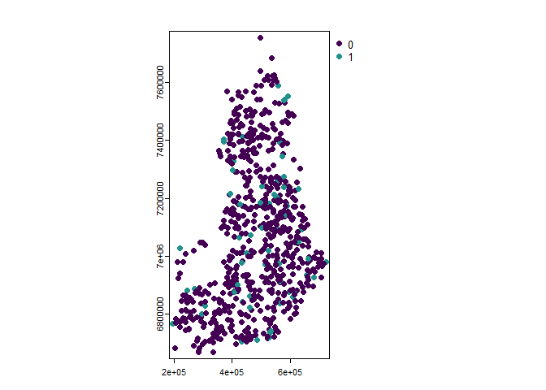

Wildlife circles matching
================
Jasper Van doninck

- [1 Wildlife circles dataset](#1-wildlife-circles-dataset)

# 1 Wildlife circles dataset

To illustrate how the pacakge can be used with pre-defined monitoring
sites, we use the dataset, which is a simplified subset of the data used
by [Terraube et al.,
2020](https://www.nature.com/articles/s41467-020-16792-7). The dataset
is a simplification of the Finnish wildlife triangles monitoring scheme.
([Helle et al.,
2016](https://cdnsciencepub.com/doi/10.1139/cjfr-2015-0454)), where each
circles is designed to approximately pass through the three corners of
the triangle made up of transects of 4 km. The dataset provides the
outline of the circles as polygons with a generic “ID” assigned, and
indicates for each circles whether it is located in a protected area
(according to
[WDPA](https://www.protectedplanet.net/en/thematic-areas/wdpa?tab=WDPA))
or not (value of 1/0 in attribute “PA”).

``` r
library(EnvImpactEval)
data(wildlife_circles)
wildlife_circles <- unwrap(wildlife_circles)

wildlife_circles
```

    ##  class       : SpatVector 
    ##  geometry    : polygons 
    ##  dimensions  : 671, 2  (geometries, attributes)
    ##  extent      : 191977.9, 727420.1, 6665446, 7757954  (xmin, xmax, ymin, ymax)
    ##  coord. ref. : ETRS89 / TM35FIN(E,N) (EPSG:3067) 
    ##  names       :    ID    PA
    ##  type        : <int> <int>
    ##  values      :     1     0
    ##                    2     0
    ##                    3     0

``` r
plot(centroids(wildlife_circles), "PA")
```

<!-- -->

In [Terraube et al.,
2020](https://www.nature.com/articles/s41467-020-16792-7), the authors
want to match wildlife circles inside protected areas to control sited
outside protected areas using six matching covariates:

- Latitude
- Longitude
- Distance to the closest settlement
- Terrain ruggedness
- Human population density
- Percentage forest cover

We will here show how to perform such analysis using the `EnvImpactEval`
package and other common R packages.

## 1.1 Matching covariates

Extracting **longitude** and **latitude** of the centroids of polygons
in a SpatVector object, as is the case here, is rather straightforward
using functions of the `terra` package, on which the `EnvImpactEval`
package builds. The following returns a data frame with for each
wildlife circle the original “ID” and “PA” columns, and additionally
columns “x” and “y” indicating the longitude and latitude of the
centroid of the wildlife circle.

``` r
LonLat <- centroids(wildlife_circles) |> as.data.frame(geom="XY")
```

**Distance to the closest settlement** can be obtained using
`osm_distance_places` function, where we define settlements
OpenStreetMap features of the category “village” or above. We set the
timeout argument to 100 (seconds) to allow retrieval of all settlements
in Finland.

``` r
dist_village <- osm_distance_places(x=wildlife_circles, values="village+", timeout=100, osm_bbox = "Finland")
```

**Terrain ruggedness** was by Terraube et al. defined as the standard
deviation of the elevation within the wildlife triangles, and was
included because large carnivores were expected to reach higher
densities in more rugged terrain. Because Finland is mostly to the north
of the area covered by the SRTM DEM, we derive the terrain ruggedness
from the ALOS DEM freely available in the Planetary Computer STAC
catalog. We specify that we want to calculate the standard deviation
based on the original 30m resolution in x and y of the ALOS DEM.

``` r
roughness <- dem(x=wildlife_circles,
                 v="elevation",
                 fun=sd,
                 dem_source=list(endpoint="https://planetarycomputer.microsoft.com/api/stac/v1",
                                 collection="alos-dem",
                                 assets="data"),
                 dx=30, dy=30)
```

There is currently no specific function in the `EnvImpactEval` package
to extract **human population density**. However, data in raster format
stored locally or accessible online can also easily be integrated. In
this example, we access the [WorldPop](https://hub.worldpop.org/)
population density of Finland for the year 2016 (the year used in
Terraube et al., 2020) at 1km resolution, found at
<https://hub.worldpop.org/geodata/summary?id=41175>. To calculate the
interpolated value of the four 1km pixels adjacent to the center of the
wildlife circles, we use the `centroids` function of the `terra` package
and set `method="bilinear"`:

``` r
popdens <- extractGeneric("https://data.worldpop.org/GIS/Population_Density/Global_2000_2020_1km/2016/FIN/fin_pd_2016_1km.tif", 
                          centroids(wildlife_circles),
                          method="bilinear",
                          bind=TRUE,
                          names.out="HumanPopDens")
```

**Percentage forest cover** was calculated by Terraube et al. (2020)
from the CORINE Land Cover (CLC) dataset for the year 2012. We
downloaded the CLC dataset for the year 2012 from the Finnish
Environment Institute (SYKE) website
<https://www.syke.fi/en/environmental-data/downloadable-spatial-datasets#corine-land-cover>
(CORINE Land Cover 2012, 20 m geotiff (zip) (latest update 30.9.2014))
and extracted the files to a local folder `C:/Data`. Extracting the
fraction of 20 m pixels over each wildlife circle that correspond to a
forest class requires knowledge of the values under which these classes
are stored (in this case values 22 through 29), and a custom function
`forestFrac_function`.

``` r
data_dir <- "C:/Data"
forestValues <- 22:29
forestFrac_function <- function(x){sum(x %in% forestValues)/length(x)}
forestFrac <- extractGeneric(file.path(data_dir, "clc2012_fi20m.tif"),
                             wildlife_circles,
                             fun=forestFrac_function,
                             bind=TRUE,
                             names.out="forestCover")
```

## 1.2 Control-impact matching

To match one wildlife circle outside protected area to each site within
a protected area without replacement using the matching covariates
defined above, we simply combine the matching covariates in a `list`
element. By setting the `asmd_warn` argument, we will generate a warning
message if the ASMD value after matching exceeds this threshold.

``` r
matches <- matchCI(wildlife_circles, 
                   matchVars=list(LonLat, dist_village, roughness, popdens, forestFrac), 
                   colname.id="ID", colname.treatment="PA",
                   ratio=1, replace=FALSE, method="nearest",
                   asmd_warn=0.1)
```

    ## Warning in matchCI(wildlife_circles, matchVars = list(LonLat, dist_village, :
    ## ASMD threshold of 0.1 exceeded for matching variables: y, elevation

``` r
head(matches)
```

    ##       ID subclass    PA
    ##    <int>   <fctr> <int>
    ## 1:     4        1     1
    ## 2:   231        1     0
    ## 3:    10        2     1
    ## 4:    82        2     0
    ## 5:    15        3     1
    ## 6:    86        3     0
